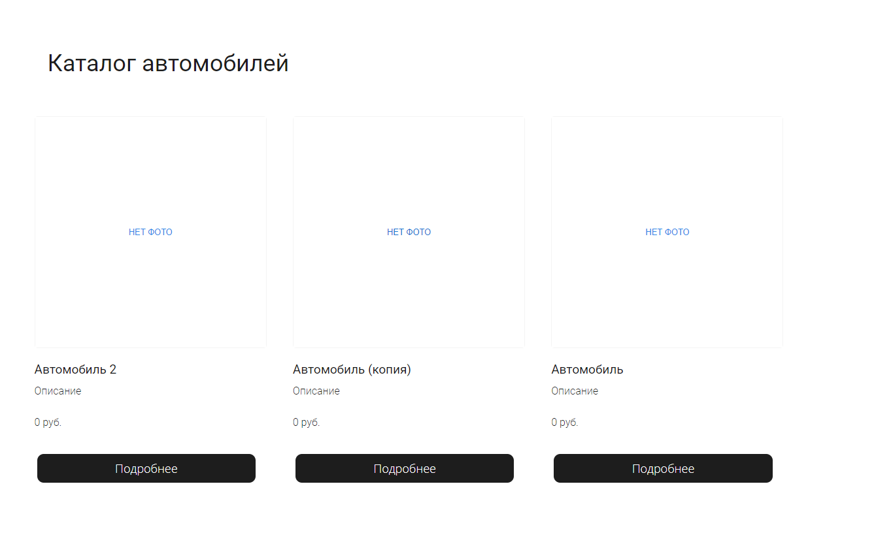

# ads-car

Учебный проект
курса [Kotlin Backend Developer](https://github.com/ahton005/adscar).
AdsCar -- это площадка, на которой пользователи публикуют и/или просматривают уже опубликованные объявления о
продаже/покупке автомобилей.
Задача площадки --
предоставить: для покупателя -- набор объявлений с определенными параметрами(цена, год выпуска, мощность, расход топлива
и тд.), для
продавца -- возможность опубликовать свое объявление, а также просмотреть цены на подобные автомобили и правильно
сформировать цену(по аналогии).

## Учебный маркетинг приложения

Целевая аудитория:

1. Человек в возрасте от 16 лет(в случае с мототехникой), желающий купить/продать автомобиль.
2. Автодиллеры желающие продать/купить/обменять(trade-in) автомобиль.
3. Кредитные организации желающие предоставить кредит/рассрочку для желающих купить автомобиль.
4. Экспертные организации желающие предоставить услуги проверки/подбора б/у автомобилей.
5. Автосервисы для ремонта/проверки автомобилей.

В рамках данного учебного проекта будет выполнен только п1.

### Гипотетический портрет пользователя приложения

Вариант 1:
Человек от 18 лет, с водительскими правами, имеет стабильный доход либо хорошую кредитную историю. Желает
приобрести/продать/поменять автомобиль.
Образование и семейное положение не важны. Пользователь ПК или мобильного устройства, с минимальными знаниями
вышеперечисленных и доступом в интернет.
Однако возможен вариант "косвенного" пользования, т.е с помощью детей, внуков, друзей, коллег. Неплохо разбирается в
автомобилях.

Вариант 2:
Человек от 16 лет, с водительскими правами(категория А), дохода в виде финансовой помощи семьи. Желает приобрести
автомобиль или мотоцикл в ближайшем будущем(2 года).
Образование и семейное положение не важны. Пользователь ПК или мобильного устройства, со средними знаниями
вышеперечисленных и доступом в интернет.
Неплохо разбирается в автомобилях или только погружается в автотему, просматривает объявления, изучает рынок.

## Эскиз front-end

### Функции (эндпониты)

1. CRUDS (create, read, update, delete, search) для объявлений (ad)

### Описание сущности ad
 1. Title
 2. Price
 3. Description
 4. Owner
 5. Logo

### Архитектура

Схема компонентов

Схема инфраструктуры
# Структура проекта

## Подпроекты для занятий по языку Kotlin

1. [m1l1-hello-world](m1l1-hello-world) - Вводное занятие, создание первой программы на Kotlin
2. [m1l3-oop](m1l3-oop) - Объектно-ориентированное программирование
3. [m1l4-dsl](m1l4-dsl) - Предметно ориентированные языки (DSL)
4. [m1l5-coroutines](m1l5-coroutines) - Асинхронное и многопоточное программирование с корутинами
5. [m1l6-flows-and-channels](m1l6-flows-and-channels) - Асинхронное и многопоточное программирование с Flow и каналами
6. [m1l7-kmp](m1l7-kmp) - Kotlin Multiplatform и интероперабельность с JVM, JS
7. [m2l2-testing](m2l2-testing) - Тестирование проекта, TDD, MDD

## Транспортные модели, API

1. [specs](specs) - описание API в форме OpenAPI-спецификаций
2. [adsCar-api-v1-jackson](adsCar-api-v1-jackson) - Генерация первой версии транспортных моделей с Jackson
3. [adsCar-common](adsCar-common) - модуль с общими классами для модулей проекта. В частности, там
   располагаются внутренние модели и контекст.
4. [adsCar-mappers-v1](adsCar-mappers-v1) - Маперы между внутренними моделями и моделями API
5. [adsCar-log-models](adsCar-log-models) - Генерация моделей логирования
6. [adsCar-mappers-log](adsCar-mappers-log) - Мапер между внутренними моделями и моделями логирования

## Фреймворки и транспорты

1. [adsCar-app-ktor](adscar-app-ktor) - Приложение на Ktor JVM
2. [ads-car-app-kafka](ads-car-app-kafka) - Микросервис на Kafka

## Мониторинг и логирование

1. [deploy](deploy) - Инструменты мониторинга и деплоя
2. [adsCar-logging](adsCar-logging) - Библиотека логирования на базе библиотеки Logback

## Модули бизнес-логики

1. [adsCar-stubs](adsCar-stubs) - Стабы для ответов сервиса
2. [app-lib-cor](app-lib-cor) - Библиотека цепочки обязанностей для бизнес-логики
3. [adsCar-business-logic](adsCar-business-logic) - Модуль бизнес-логики приложения

## Хранение, репозитории, базы данных

1. [app-repo-tests](app-repo-tests) - Базовые тесты для репозиториев всех баз данных
2. [app-repo-in-memory](app-repo-in-memory) - Репозиторий на базе кэша в памяти для тестирования
3. [app-repo-cassandra](app-repo-cassandra) - Репозиторий с NoSql DB Cassandra
