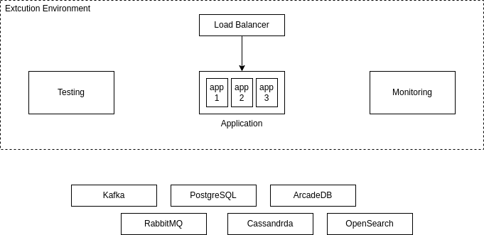

# ads-car

Учебный проект
курса [Kotlin Backend Developer](https://github.com/ahton005/adscar).
AdsCar -- это площадка, на которой пользователи публикуют и/или просматривают уже опубликованные объявления о
продаже/покупке автомобилей.
Задача площадки --
предоставить: для покупателя -- набор объявлений с определенными параметрами(цена, год выпуска, мощность, расход топлива
и тд.), для
продавца -- возможность опубликовать свое объявление, а также просмотреть цены на подобные автомобили и правильно
сформировать цену(по аналогии).

## Учебный маркетинг приложения

Целевая аудитория:

1. Человек в возрасте от 16 лет(в случае с мототехникой), желающий купить/продать автомобиль.
2. Автодиллеры желающие продать/купить/обменять(trade-in) автомобиль.
3. Кредитные организации желающие предоставить кредит/рассрочку для желающих купить автомобиль.
4. Экспертные организации желающие предоставить услуги проверки/подбора б/у автомобилей.
5. Автосервисы для ремонта/проверки автомобилей.

В рамках данного учебного проекта будет выполнен только п1.

### Гипотетический портрет пользователя приложения

Вариант 1:
Человек от 18 лет, с водительскими правами, имеет стабильный доход либо хорошую кредитную историю. Желает
приобрести/продать/поменять автомобиль.
Образование и семейное положение не важны. Пользователь ПК или мобильного устройства, с минимальными знаниями
вышеперечисленных и доступом в интернет.
Однако возможен вариант "косвенного" пользования, т.е с помощью детей, внуков, друзей, коллег. Неплохо разбирается в
автомобилях.

Вариант 2:
Человек от 16 лет, с водительскими правами(категория А), дохода в виде финансовой помощи семьи. Желает приобрести
автомобиль или мотоцикл в ближайшем будущем(2 года).
Образование и семейное положение не важны. Пользователь ПК или мобильного устройства, со средними знаниями
вышеперечисленных и доступом в интернет.
Неплохо разбирается в автомобилях или только погружается в автотему, просматривает объявления, изучает рынок.

## Эскиз front-end

### Функции (эндпониты)

1. CRUDS (create, read, update, delete, search) для объявлений (ad)

### Описание сущности ad
 1. Title
 2. Price
 3. Description
 4. Owner
 5. Logo

### Архитектура

Схема компонентов

Схема инфраструктуры
# Структура проекта

## Подпроекты для занятий по языку Kotlin

1. [m1l1-hello-world](m1l1-hello-world) - Вводное занятие, создание первой программы на Kotlin
3. [m1l3-oop](m1l3-oop) - Объектно-ориентированное программирование
3. [m1l4-dsl](m1l4-dsl) - Предметно ориентированные языки (DSL)
4. [m1l5-coroutines](m1l5-coroutines) - Асинхронное и многопоточное программирование с корутинами
4. [m1l6-flows-and-channels](m1l6-flows-and-channels) - Асинхронное и многопоточное программирование с Flow и каналами
5. [m1l7-kmp](m1l7-kmp) - Kotlin Multiplatform и интероперабельность с JVM, JS
6. [m2l2-testing](m2l2-testing) - Тестирование проекта, TDD, MDD

## Транспортные модели, API - в разработке

1. [specs](specs) - описание API в форме OpenAPI-спецификаций
2. [ok-marketplace-api-v1-jackson](adsCar-api-v1-jackson) - Генерация первой версии транспортных модеелй с
   Jackson
3. [ok-marketplace-common](adsCar-common) - модуль с общими классами для модулей проекта. В частности, там
   располагаются внутренние модели и контекст.
4. [ok-marketplace-mappers-v1](ok-marketplace-mappers-v1) - Мапер между внутренними моделями и моделями API v1

## Фреймворки и транспорты - в разработке

[//]: # (1. [ok-marketplace-services]&#40;ok-marketplace-services&#41; - Сервис. Служит оберткой для модуля бизнес-логики. Подключается)

[//]: # (   всеми фреймворками &#40;модулями `*-app-*`&#41;)

[//]: # (1. [ok-marketplace-app-spring]&#40;ok-marketplace-app-spring&#41; - Приложение на Spring Framework)

[//]: # (1. [ok-marketplace-app-ktor]&#40;ok-marketplace-app-ktor&#41; - Приложение на Ktor JVM)

[//]: # (1. [ok-marketplace-app-ktor-native]&#40;ok-marketplace-app-ktor-native&#41; - Приложение на Ktor Native)

[//]: # (1. [ok-marketplace-app-ktor-common]&#40;ok-marketplace-app-ktor-common&#41; - Общая логика для Ktor JVM и Ktor Native)

[//]: # (1. [ok-marketplace-app-knative]&#40;ok-marketplace-app-knative&#41; - Скрипты запуска приложения в KNative)

[//]: # (1. [ok-marketplace-app-rabbit]&#40;ok-marketplace-app-rabbit&#41; - Микросервис на RabbitMQ)

[//]: # (1. [ok-marketplace-app-kafka]&#40;ok-marketplace-app-kafka&#41; - Микросервис на Kafka)

## Модули бизнес-логики - в разработке

[//]: # (1. [ok-marketplace-stubs]&#40;ok-marketplace-stubs&#41; - Стабы для ответов сервиса)

[//]: # (1. [ok-marketplace-biz]&#40;ok-marketplace-biz&#41; - Модуль бизнес-логики приложения)

## Хранение, репозитории, базы данных - в разработке

[//]: # (1. [ok-marketplace-repo-test]&#40;ok-marketplace-repo-test&#41; - Базовые тесты для репозиториев всех баз данных)

[//]: # (2. [ok-marketplace-repo-inmemory]&#40;ok-marketplace-repo-inmemory&#41; - Репозиторий на базе кэша в памяти для тестирования)

[//]: # (3. [ok-marketplace-repo-sql]&#40;ok-marketplace-repo-sql&#41; - Репозиторий на базе PostgreSQL)

[//]: # (4. [ok-marketplace-repo-cassandra]&#40;ok-marketplace-repo-cassandra&#41; - Репозиторий на базе Cassandra)

[//]: # (5. [ok-marketplace-repo-gremlin]&#40;ok-marketplace-repo-gremlin&#41; - Репозиторий на базе Apache TinkerPop Gremlin и ArcadeDb)
